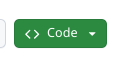

Minceraft

TO DO THIS U NEED A GITHUB ACCOUNT

click this button 
 
</img>

run npx serve in the termnail

go to ports

public port

go to webpage

(its easy if u cant do it then its a skill issue)
